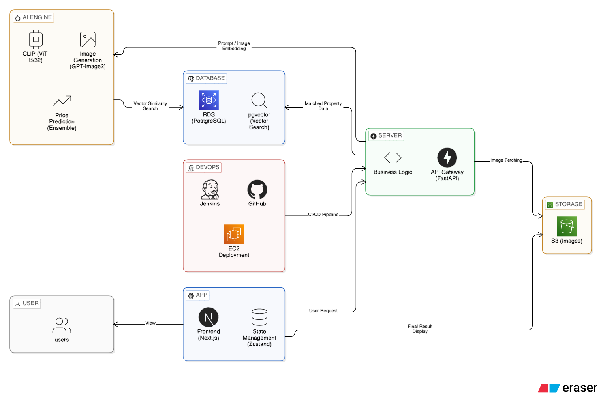
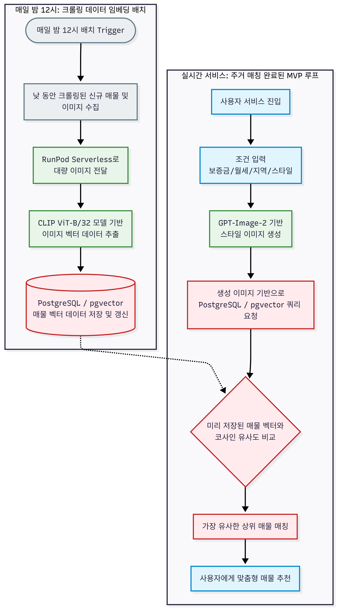
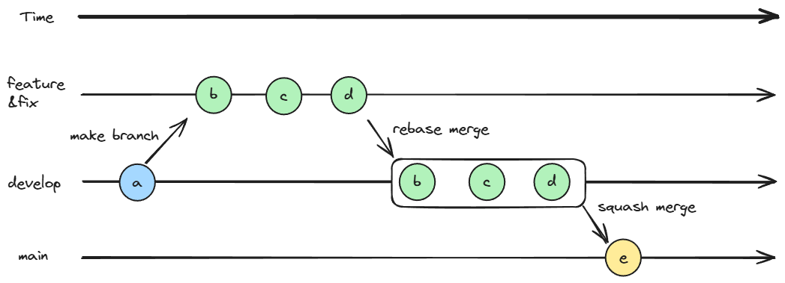
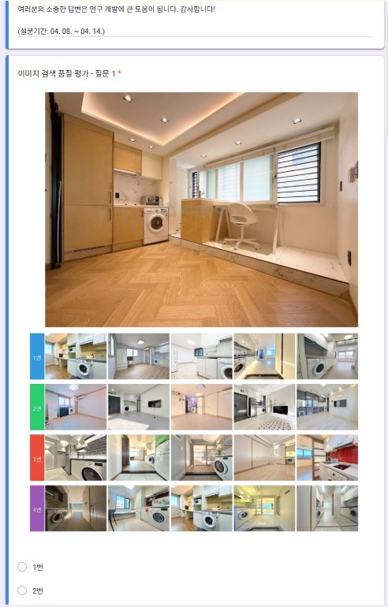
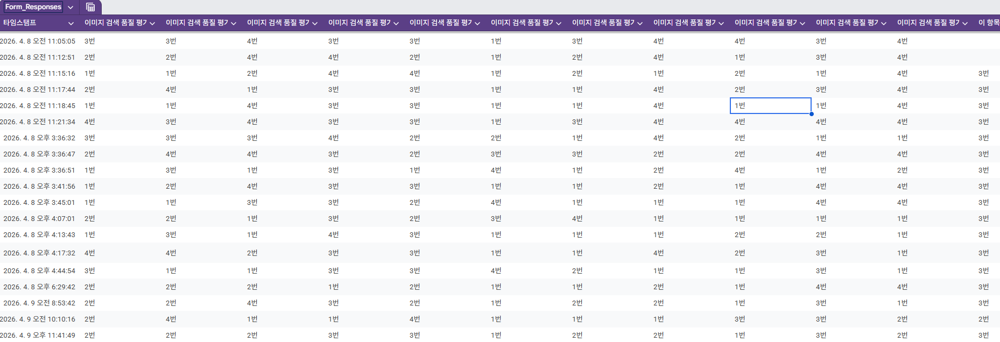
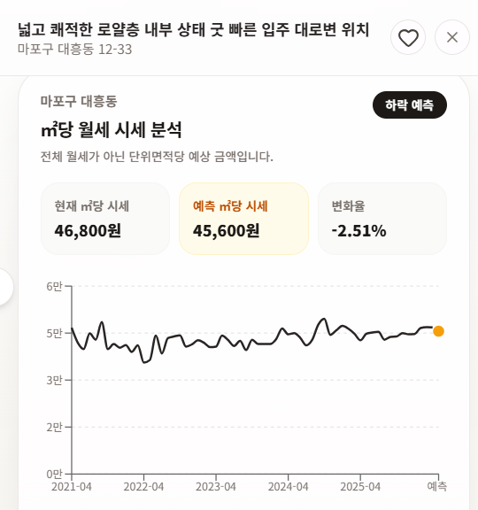
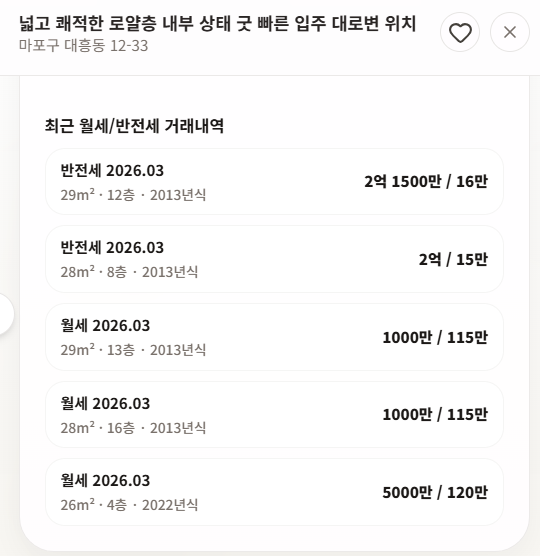

> # **"당신의 상상을 현실의 매물로 연결합니다"** 
> 
> LLM 기반 이미지 생성과 Vector Similarity Search를 결합한 지능형 부동산 큐레이션 서비스
---
## **1. 팀원소개**

| PM | APM | 팀원 | 팀원 |
| :---: | :---: | :---: | :---: |
| | | | |
| **유헌상** | **정희영** | **김도영** | **신승훈** |
| [](https://github.com/hunsang-you) | [](https://github.com/JUNGHEEYOUNG9090) | [](https://github.com/rubyheartsping) | [](https://github.com/seunghun92-lab) |


---
## **2. 개발배경**
### 부동산 시장의 '언어적 한계'와 정보 비대칭

사용자가 원하는 주거 공간은 "아늑한", "개방감 있는", "빈티지한" 등 매우 추상적이고 감성적인 언어로 표현됩니다. 하지만 현재의 부동산 플랫폼은 오직 면적, 가격, 방 개수와 같은 **수치적 필터**만을 제공합니다. 이로 인해 사용자는 수천 개의 매물을 일일이 클릭하며 자신의 취항과 맞는지 확인해야 하는 수고를 겪고 있습니다.


### 시각적 구체화의 필요성 (Text-to-Image)

사람은 자신의 요구사항을 텍스트보다 **시각적 이미지**로 접했을 때 더 명확한 의사결정을 내립니다. 저희는 사용자의 모호한 설명을 LLM과 생성형 AI(GPT-IMAGE-2)를 통해 **구체적인 공간 이미지로 실체화**함으로써, 사용자가 "내가 정말로 원하는 공간"이 무엇인지 먼저 인지하도록 돕습니다.


### 상상을 현실로 연결하는 기술 (Semantic Matching)

단순한 이미지 생성을 넘어, 생성된 이미지의 특징점(Feature)을 추출하고 이를 실제 매물 데이터와 **시맨틱 매칭(Vector Similarity Search)**합니다. 이는 단순히 "비슷한 사진"을 찾는 것이 아니라, 사용자가 상상한 공간의 **'분위기'와 '구조'를 가진 실제 매물**을 연결해주는 혁신적인 검색 경험을 제공합니다.


### 데이터 기반의 합리적 선택 (Price Estimation)

감성적인 만족뿐만 아니라 경제적인 합리성까지 놓치지 않기 위해, **머신러닝 기반의 시세 예측 시스템**을 구축했습니다. 이를 통해 사용자는 취향에 맞는 집이 시장가 대비 적정한 가격인지 판단할 수 있는 객관적인 가이드를 제공받게 됩니다.


---
## **3. 기술스택**
### **Modeling**


### **Library**


### **Frontend**


### **Environment & Backend**


### **API**


### **Infrastructure & DevOps**


---
## **4. 프로젝트 구조**
```text
SKN23-FINAL-1Team/
    ├── .github/               # GitHub 워크플로우 및 레포 설정
    ├── .vscode/               # VS Code 워크스페이스 설정
    ├── backend/               # FastAPI 백엔드 서비스 코드
    │   ├── api/
    │   │   └── v1/            # 버전별 API 엔드포인트 정의
    │   ├── core/              # 앱 설정 및 핵심 구성
    │   ├── create_image/      # 이미지 생성 관련 기능
    │   ├── crud/              # DB CRUD 로직 및 공통 함수
    │   ├── db/                # DB 연결 / 세션 / 베이스 모델
    │   ├── models/            # ORM 모델 정의
    │   ├── routers/           # 라우터와 엔드포인트 모듈
    │   ├── schemas/           # 요청/응답 데이터 스키마
    │   ├── services/          # 비즈니스 로직 및 서비스 계층
    │   ├── tests/             # 백엔드 테스트 코드
    │   └── utils/             # 공통 유틸리티 함수 (예: S3)
    ├── documents/             # 설계서, 스펙 문서
    ├── frontend/              # Next.js 프론트엔드 앱
    │   ├── app/               # Next.js 라우트 및 페이지
    │   │   ├── api/           # 클라이언트 API 라우트
    │   │   ├── mypage/        # 마이페이지 관련 화면
    │   │   ├── register/      # 회원가입/등록 화면
    │   │   ├── register-photo/# 사진 등록 화면
    │   │   └── [locale]/      # 다국어 지원 라우트
    │   ├── assets/            # 앱 자산 파일
    │   ├── components/        # UI 컴포넌트 모음
    │   │   ├── common/        # 공통 컴포넌트
    │   │   ├── feature/       # 기능별 컴포넌트
    │   │   ├── mypage/        # 마이페이지 컴포넌트
    │   │   ├── room-finder/   # 매물 탐색 UI 컴포넌트
    │   │   └── ui/            # UI 구성 요소
    │   ├── hooks/             # 커스텀 훅
    │   ├── lib/               # 프론트 공통 라이브러리
    │   ├── messages/          # 메시지/문구 관리
    │   ├── public/            # 공개 정적 파일
    │   ├── store/             # 상태 관리
    │   ├── styles/            # 스타일 정의
    │   ├── types/             # 타입스크립트 타입 정의
    │   └── utils/             # 프론트 유틸 함수
    ├── img/                   # 프로젝트 이미지 자산
    ├── market_price_crawling/ # 시세 크롤링 스크립트
    ├── ml_research/           # ML 연구 및 모델 실험 코드
    │   ├── catboost/          # CatBoost 관련 자료
    │   ├── lightGBM/          # LightGBM 관련 자료
    │   ├── RandomForest/      # RandomForest 관련 자료
    │   └── xgboost/           # XGBoost 관련 자료
    └── zigbang_crawling/      # 직방 크롤링 스크립트
```
---
## **5. 시스템 아키텍처**
### 5-1. WorkFlow Diagram
<p align="center">

<p align="center">


### Service Data Flow

1. **User Interaction**: Next.js 기반 프론트엔드에서 사용자 요구사항 수집 및 Zustand를 통한 상태 관리.
2. **AI Processing**: FastAPI를 통해 OpenAI API와 통신, 사용자의 요구사항을 시각화(Image Generation).
3. **Vector Search Pipeline**: 생성된 공간 이미지를 벡터화하여 PostgreSQL의 PGVector 익스텐션을 통해 수만 건의 매물 데이터와 실시간 유사도 매칭.
4. **ML Inference**: 시세 예측 모델을 통해 매물별 적정 가격 가이드 산출.
5. **Deployment**: AWS EC2와 Docker Compose를 활용한 컨테이너 기반 배포 및 Jenkins를 통한 CI/CD 구축.

### Deployment Architecture

저희 서비스는 AWS 클라우드 인프라를 기반으로 구축되었으며, Docker와 Jenkins를 활용하여 안정적인 배포 파이프라인을 유지합니다.

- **Compute**: AWS EC2에서 Frontend(Next.js) 및 Backend(FastAPI)를 컨테이너화하여 운영.
- **Storage**: 사용자 생성 이미지 및 매물 이미지는 **AWS S3**를 통해 효율적으로 관리 및 서빙.
- **Database**: **AWS RDS (PostgreSQL)**를 활용하여 데이터 정합성을 확보하고, **PGVector** 익스텐션을 통해 벡터 검색 최적화.
- **CI/CD**: GitHub Webhook - Jenkins - Docker를 연동하여 코드 수정 시 자동 빌드 및 무중단 배포(선택사항 시) 환경 구축.

### 5-2. ERD
<p align="center">


### 5-3. 브랜치 관리 전략
<p align="center">



- develop을 베이스로하여 작업단위마다 feature, fix 등의 브랜치를 생성해 작업
- 작업 완료 후, develop 브랜치에 merge 후 develop 브랜치에 자동 배포

---
## **6. 테스트 로그 및 평가**
### 5-1. 이미지 선정
#### 설문조사
<p align="center">



#### 설문조사 결과
<p align="center">

</p>


### 5-2. 부하테스트
### 매물 조회 API 성능 테스트

<table width="100%">
  <thead>
    <tr>
      <th width="15%" align="center">테스트</th>
      <th width="15%" align="center">동시 사용자(VU)</th>
      <th width="15%" align="center">총 요청</th>
      <th width="15%" align="center">실패율</th>
      <th width="15%" align="center">평균 응답</th>
      <th width="15%" align="center">p95 응답</th>
      <th width="10%" align="center">결과</th>
    </tr>
  </thead>
  <tbody>
    <tr>
      <td align="center">검색 API</td>
      <td align="right">30명</td>
      <td align="right">2,294건</td>
      <td align="right">0%</td>
      <td align="right">82ms</td>
      <td align="right">128ms</td>
      <td align="center"><b>통과</b></td>
    </tr>
    <tr>
      <td align="center">검색 API</td>
      <td align="right">100명</td>
      <td align="right">5,715건</td>
      <td align="right">0%</td>
      <td align="right">324ms</td>
      <td align="right">837ms</td>
      <td align="center"><b>통과</b></td>
    </tr>
    <tr>
      <td align="center">검색 API</td>
      <td align="right">120명</td>
      <td align="right">6,219건</td>
      <td align="right">0%</td>
      <td align="right">515ms</td>
      <td align="right">1,302ms</td>
      <td align="center"><b>통과</b></td>
    </tr>
    <tr>
      <td align="center">검색 API</td>
      <td align="right">150명</td>
      <td align="right">6,695건</td>
      <td align="right">0%</td>
      <td align="right">888ms</td>
      <td align="right">2,298ms</td>
      <td align="center"><font color="#d32f2f"><b>실패</b></font></td>
    </tr>
    <tr>
      <td align="center">검색 API</td>
      <td align="right">200명</td>
      <td align="right">7,172건</td>
      <td align="right">0%</td>
      <td align="right">1,543ms</td>
      <td align="right">3,506ms</td>
      <td align="center"><font color="#d32f2f"><b>실패</b></font></td>
    </tr>
  </tbody>
</table>

<br/>

### 🎨 AI 이미지 생성 성능 테스트 (1장 기준)

<table width="100%">
  <thead>
    <tr>
      <th width="12%" align="center">테스트</th>
      <th width="12%" align="center">동시 사용자</th>
      <th width="10%" align="center">생성 작업</th>
      <th width="10%" align="center">완료</th>
      <th width="10%" align="center">실패</th>
      <th width="10%" align="center">완료율</th>
      <th width="14%" align="center">평균 생성</th>
      <th width="14%" align="center">p95 생성</th>
      <th width="8%" align="center">결과</th>
    </tr>
  </thead>
  <tbody>
    <tr>
      <td align="center">이미지 생성</td>
      <td align="right">3명</td>
      <td align="right">18건</td>
      <td align="right">17건</td>
      <td align="right">0건</td>
      <td align="right">100%</td>
      <td align="right">29.3초</td>
      <td align="right">36.9초</td>
      <td align="center"><b>통과</b></td>
    </tr>
    <tr>
      <td align="center">이미지 생성</td>
      <td align="right">10명</td>
      <td align="right">57건</td>
      <td align="right">57건</td>
      <td align="right">0건</td>
      <td align="right">100%</td>
      <td align="right">29.4초</td>
      <td align="right">35.1초</td>
      <td align="center"><b>통과</b></td>
    </tr>
    <tr>
      <td align="center">이미지 생성</td>
      <td align="right">15명</td>
      <td align="right">90건</td>
      <td align="right">76건</td>
      <td align="right">11건</td>
      <td align="right">87.4%</td>
      <td align="right">29.0초</td>
      <td align="right">40.1초</td>
      <td align="center"><b>통과</b></td>
    </tr>
    <tr>
      <td align="center">이미지 생성</td>
      <td align="right">20명</td>
      <td align="right">117건</td>
      <td align="right">77건</td>
      <td align="right">39건</td>
      <td align="right">66.4%</td>
      <td align="right">31.9초</td>
      <td align="right">41.1초</td>
      <td align="center"><font color="#d32f2f"><b>실패</b></font></td>
    </tr>
    <tr>
      <td align="center">이미지 생성</td>
      <td align="right">50명</td>
      <td align="right">327건</td>
      <td align="right">75건</td>
      <td align="right">243건</td>
      <td align="right">23.6%</td>
      <td align="right">34.2초</td>
      <td align="right">45.1초</td>
      <td align="center"><font color="#d32f2f"><b>실패</b></font></td>
    </tr>
  </tbody>
</table>

> 📌 **주의 사항:** 이미지 생성 테스트는 1명당 1장 생성 기준입니다. 실제 서비스처럼 1명당 4장을 생성하게 되면 외부 API 사용량(Rate Limit) 및 부하가 4배로 증가합니다.

<br/>

### 💡 최종 결론 및 성능 평가

<table width="100%">
  <thead>
    <tr>
      <th width="30%" align="center">기능</th>
      <th width="70%" align="center">안정 기준 및 기대 효과</th>
    </tr>
  </thead>
  <tbody>
    <tr>
      <td align="left"><b>매물 조회 API</b></td>
      <td>120명 동시 조회까지 안정적으로 트래픽 수용 가능</td>
    </tr>
    <tr>
      <td align="left"><b>AI 이미지 생성</b></td>
      <td>1장 기준 15명 동시 생성까지 기준 충족</td>
    </tr>
    <tr>
      <td align="left"><b>AI 이미지 생성 현재 한도</b></td>
      <td>OpenAI 20 images/min 제한 때문에, 4장 생성 기준 분당 약 5명 처리 가능</td>
    </tr>
    <tr>
      <td align="left"><b>큐 적용 후 기대 효과</b></td>
      <td>실패율 발생 대신 <b>대기열(Queue) 처리 방식</b>을 도입하여 시스템 안정성 대폭 개선 가능</td>
    </tr>
  </tbody>
</table>

---

## **7. 핵심기능**

### 1. AI 기반 주거 공간 시각화 & 시맨틱 이미지 매칭 추천
<p align="center">


###  2. AI 부동산 시세 예측 가이드 (AI Price Estimation)
<p align="center">

<p align="center">



---
## 8. 회고
| 이름 | 회고 내용 |
| :---: | :--- |
| **유헌상** | 2달간의 프로젝트를 진행하면서 이전에 모호하게 알고 있는 개념이나 이론도 조금씩 더 깊게 알 수 있는 시간이었다. PM으로서 부족하거나 미숙한 부분이 많았겠지만, 잘 마무리 된 것 같다. 일주일만 더 시간이 있었으면 더 많은 기능들을 추가했을 것 같은데 아쉬운 부분도 있고 끝나서 후련하기도 하다  |
| **정희영** | SKN23기 마지막 프로젝트이다. 좋은 팀원들과 프로젝트를 하며 APM이라는 직책을 맡아 프로젝트를 진행하였다. 6달이라는 기간동안 많은 것을 배웠고 마지막 프로젝트에 그간 배운 것을 쏟아넣을 수 있었다. 앞으로도 갈 길이 멀다고 생각하지만 지금까지 배운 것은 좋은 발판이 되어줄 것이다. 함께해준 팀원들과 동기들이 앞으로 꽃길만 밟기를 바라며 회고를 마치겠다. |
| **김도영** | 지난 두 달 간 LLM을 활용한 부동산 서비스 개발에 착수 했다. 이 때까지 배운 것들을 종합적으로 되돌아보며 어떤 기술을 어느 상황에 써야하는가에 대해 몸소 익힐 수 있었다. 한편으로, 이런 기술적인 것 이상으로 어떻게 협업을 해야하는가에 대해 깊이 알 수 있는 시간이었다. 지난 4번의 프로젝트, 그리고 이번 프로젝트를 거치며 비로소 개발자로서의 첫 발걸음을 내딛은 느낌이다. 함께해준 동기분들, 특히나 1팀 여러분들께 다시한번 감사의 말씀 전하며 이번 과정을 뜻깊게 마무리 짓고자 한다. |
| **신승훈** | 이번 프로젝트에서 처음으로 풀스택 개발을 경험하며 프론트엔드와 백엔드 CRUD API를 구현하고 AI 이미지 생성 기능을 통합했습니다. 특히 임베딩 모델을 고를 때 4가지 모델을 직접 돌려보면서 성능과 속도를 비교했는데, 이론으로만 알던 것을 직접 테스트해보니 확실히 달랐습니다. 30만 건 이미지 임베딩을 처리하면서 대용량 데이터를 다루는 법도 배웠고, 프론트에서 백엔드까지 데이터가 어떻게 흐르는지 전체 그림을 이해하게 됐습니다. 협업 측면에서는 IDD 브랜치 전략과 Jenkins 자동 배포를 팀에서 사용하면서, 체계적인 협업 프로세스가 개인의 생산성뿐만 아니라 팀 전체의 개발 속도에 얼마나 큰 영향을 미치는지 체감했습니다. 가장 기억에 남는 건 모델 선정 과정인데, 단순히 성능 좋은 것을 고르는 게 아니라 우리 프로젝트에 맞는 것을 찾는 게 중요하다는 걸 배웠습니다. 2개월간 같이 고생했던 팀원들한테 감사의 말씀을 전하고 싶습니다! |


