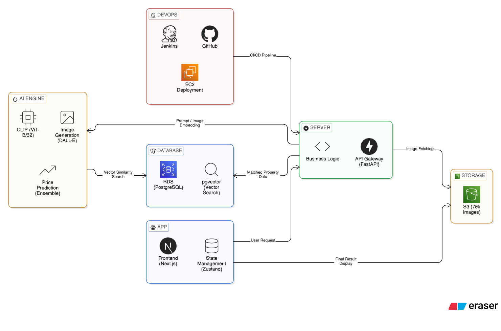
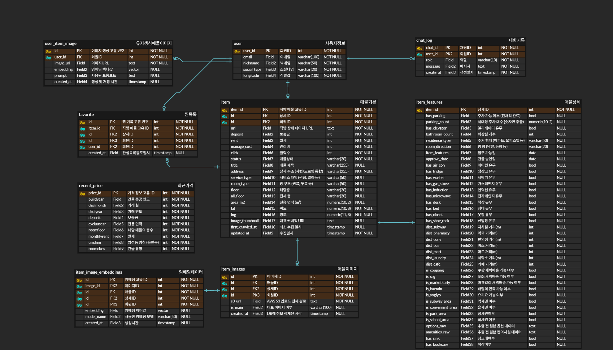

> # **"당신의 상상을 현실의 매물로 연결합니다"** 
> 
> LLM 기반 이미지 생성과 Vector Similarity Search를 결합한 지능형 부동산 큐레이션 서비스
---

| PM | APM | 팀원 | 팀원 |
| :---: | :---: | :---: | :---: |
| **유헌상** | **정희영** | **김도영** | **신승훈** |
|  |  |  |  |

---
## **2. 개발배경**

---
## **3. 기술스택**
### **Modeling**

### **Library**

### **Frontend**

### **Environment & Backend**

### **API**

### **Infrastructure & DevOps**

---
## **4. 프로젝트 구조**
    SKN23-FINAL-1Team/
        ├── .env.example
        ├── docker-compose.prod.yml
        ├── Jenkinsfile
        ├── README.md
        │
        ├── backend/
        │   ├── api/
        │   ├── core/
        │   ├── db/
        │   ├── models/
        │   ├── routers/
        │   ├── schemas/
        │   ├── services/
        │   ├── tests/
        │   └── utils/
        │
        ├── frontend/
        │   ├── app/
        │   │   ├── (auth)/
        │   │   ├── (main)/
        │   │   ├── api/
        │   │   └── mypage/
        │   ├── components/
        │   │   ├── common/
        │   │   ├── feature/
        │   │   ├── room-finder/
        │   │   └── ui/
        │   ├── hooks/
        │   ├── lib/
        │   ├── store/
        │   ├── styles/
        │   └── types/
        │
        ├── ml_research/
        │   └── lightGBM/
        │
        ├── zigbang_crawling/
        ├── market_price_crawling/
        └── documents/
---
## **5. 시스템 아키텍처**

---
## **6. 테스트 로그 및 평가**

---
## **7. 핵심기능**
- AI 기반 주거 공간 시각화 (Text-to-Interior Generation)

- 시맨틱 이미지 매칭 추천 (Semantic Property Matching)

- AI 부동산 시세 예측 가이드 (AI Price Estimation)

- 마이페이지

    최근 본 매물, AI 생성 갤러리

---
## **8. 산출물**

